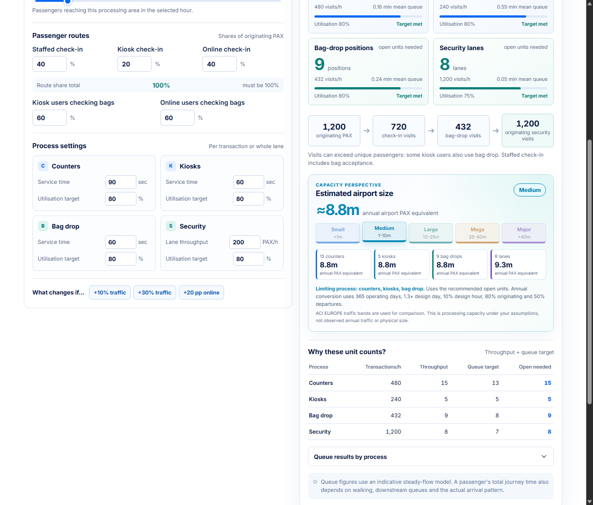

<div align="center">

# Passenger Processing & Resource Calculator

**From passengers to processing capacity.**

Size the check-in counters, self-service kiosks, bag drops, and security lanes needed for a busy period—or work backwards from the units you can open.

[**Open the calculator ↗**](https://burakdagdeviren.github.io/Passenger-Processing-and-Resource-Calculator/) · [How it works](#how-the-model-works) · [Run locally](#run-locally)

`React` · `Vite` · `Erlang C` · `Browser-based`

</div>



## What can it answer?

| Mode | Question | Output |
| --- | --- | --- |
| **Demand → resources** | How many processing points should be open for this passenger flow? | Recommended counters, kiosks, bag drops, and security lanes, with throughput and indicative queue checks. |
| **Resources → capacity** | How many originating passengers can the open points process? | Capacity by process, the limiting process, and any shortfall against demand. |
| **Baseline ↔ what-if** | What changes when traffic, online adoption, or service assumptions change? | Side-by-side demand and resource comparison. |

The calculator also translates the limiting capacity of the four processes into an **annual airport-passenger equivalent**. Its colored size band is a comparison with [ACI EUROPE's annual traffic groups](https://www.aci-europe.org/mediaroom/579-2025-all-about-traffic-resilience-as-europe-s-airports-welcomed-an-additional-100-million-passengers.html); it is **not** a measure of physical airport size or observed annual traffic.

### A useful first pass

- Start with **originating passengers in the peak hour**, or select one alternative traffic basis: peak-hour departing passengers, annual airport passengers, or annual departing passengers.
- Split originating passengers between **staffed**, **kiosk**, and **online** check-in. A kiosk passenger checking a bag visits both the kiosk and bag drop; staffed check-in includes bag acceptance in its service time.
- Edit service times, lane throughput, target utilization, and the percentage of customers who should start service within the chosen waiting-time target.
- Check the proposed open units, then create a what-if scenario or switch to capacity mode. Advanced inputs cover transfers, bags, short bursts, dedicated queues, unavailable units, and reserves.
- Export scenarios as JSON or results as CSV; the print view provides a compact report. Scenarios remain in browser storage unless you export them.

## How the model works

The calculations are transparent and intentionally scoped to the four modeled processes. The source of truth is [`src/calculations.js`](src/calculations.js).

**1. Convert the selected traffic basis into one originating peak-hour demand.** Annual airport and annual departing figures are *alternative inputs*, never added together. For annual airport traffic:

```text
originating PAX / design hour
  = annual airport PAX
    × departure share
    × originating share of departures
    ÷ operating days
    × design-day factor
    × design-hour share
```

**2. Route passengers through the processes they actually use.** Staffed, kiosk, and online check-in shares sum to 100%. Bag participation adds bag-drop visits to the relevant kiosk and online routes. Originating security demand uses its own selected share; transfer rescreening is additional background security work. Visits across processes can therefore exceed unique passengers.

**3. Size each service pool for throughput and an indicative queue target.** For transaction arrival rate `λ` per hour, service time `s` seconds, and target utilization `u`:

```text
service rate per unit μ = 3,600 ÷ s
throughput units      = ceiling(λ ÷ (μ × u))
recommended open units = max(throughput units, queue-target units, configured minimum)
```

The queue-target count is the smallest number of open units meeting the selected `P(wait ≤ target minutes)` under an **M/M/c Erlang-C** model. Dedicated pools are calculated and rounded separately. A security lane's entered passengers/hour represents whole-lane effective throughput.

**4. Reverse the model for capacity mode.** The calculator finds each open pool's usable transaction rate under the same utilization and queue targets, subtracts fixed background work, and divides by the applicable passenger-route share. The lowest resulting originating-passenger rate limits the modeled system.

**5. Express that bottleneck as an annual equivalent.** Each process's hourly originating capacity is converted back through the entered operating days, design-day factor, design-hour share, originating share, and departure share. The lowest of the four annual equivalents determines the displayed band. In demand mode this uses *recommended open units*; in capacity mode it uses *currently open units*.

### Illustrative example

With **1,200 originating passengers/hour**, a **40% staffed / 20% kiosk / 40% online** check-in mix, and the editable default service and queue assumptions:

| Process | Visits/hour | Recommended open units |
| --- | ---: | ---: |
| Staffed check-in | 480 | 15 counters |
| Self-service check-in | 240 | 5 kiosks |
| Bag drop | 432 | 9 bag drops |
| Security | 1,200 | 8 lanes |

The annual capacity equivalent is approximately **8.8 million airport passengers**, using the default annual conversion assumptions. These values illustrate the model; replace them with airport-specific observations before planning an investment.

## Run locally

Use Node.js 24 and npm:

```bash
git clone https://github.com/burakdagdeviren/Passenger-Processing-and-Resource-Calculator.git
cd Passenger-Processing-and-Resource-Calculator
npm ci
npm run dev
```

The development server prints its local address. To verify and build the production site:

```bash
npm test
npm run build
npm run preview
```

The static build is written to `dist/`. Every push to `main` runs the tests and build before the [GitHub Pages workflow](.github/workflows/pages.yml) publishes that directory.

## Planning boundaries

This is an **indicative processing model**, not a terminal design approval or a waiting-time simulation. Erlang C assumes steady independent arrivals, exponentially distributed service times, identical servers, and a common queue within each pool. The 15-minute burst option applies a steady stress rate; it does not simulate queue carry-over between intervals. Walking time, downstream congestion, staffing rosters, and real arrival variability are outside the model.

Illustrative defaults are clearly marked and editable. Use measured route shares, service cycles, lane rates, and passenger-arrival profiles whenever available. The interface records assumption provenance so a saved scenario can be reviewed with its source note.

### References

- [IATA — Demand Triggers for Airport Investments](https://www.iata.org/contentassets/d1d4d535bf1c4ba695f43e9beff8294f/demand-triggers-for-airport-investments.pdf)
- [ACRP Report 25 — Airport Passenger Terminal Planning and Design](https://crp.trb.org/acrpwebresource2/acrp-report-25-airport-passenger-terminal-planning-and-design-volume-2-spreadsheet-models-and-users-guide/)
- [MIT — Multi-server queue model](https://web.mit.edu/urban_or_book/www/book/chapter4/4.6.2.html)
- [ACI EUROPE — Annual passenger traffic groups](https://www.aci-europe.org/mediaroom/579-2025-all-about-traffic-resilience-as-europe-s-airports-welcomed-an-additional-100-million-passengers.html)
